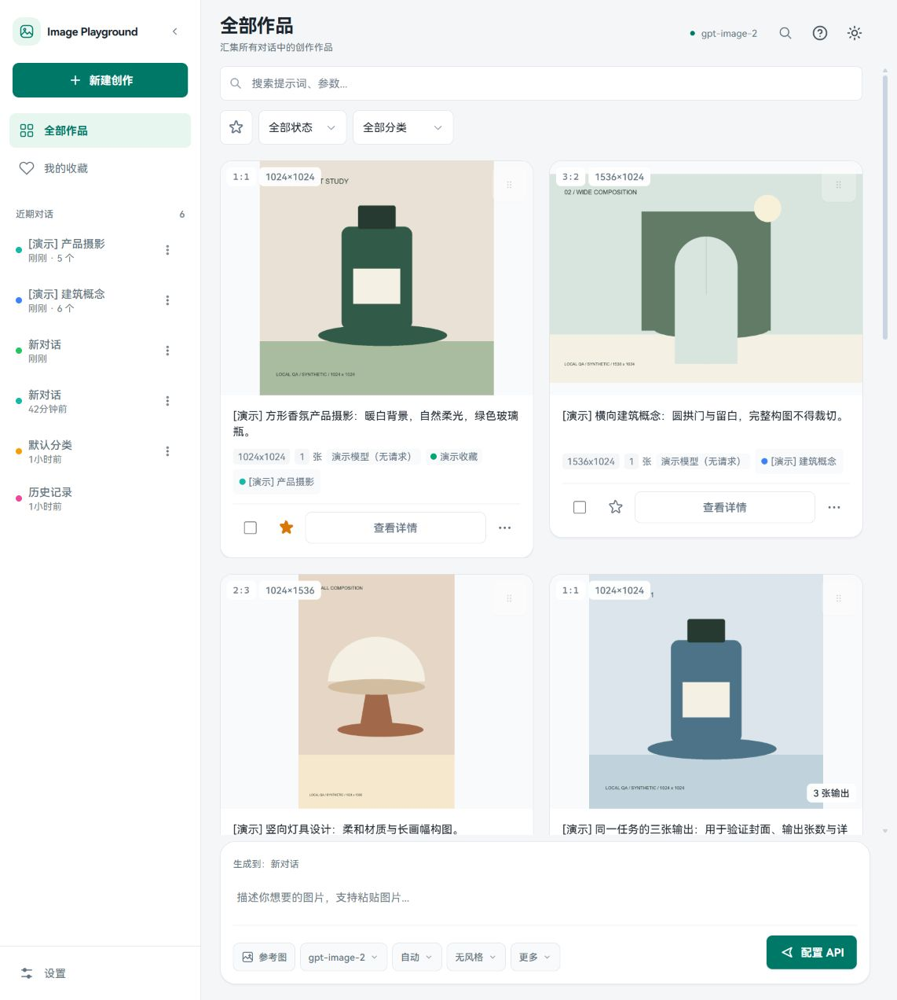
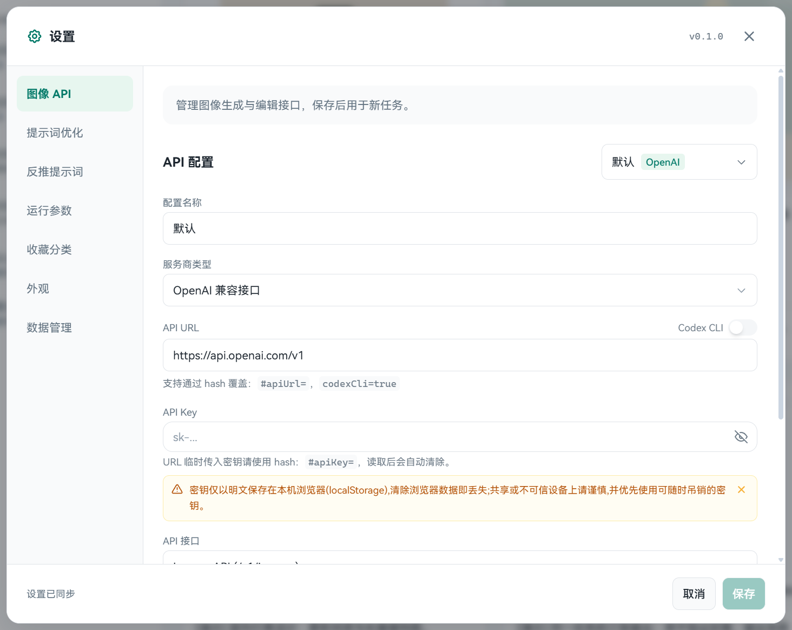
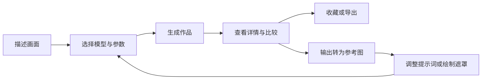
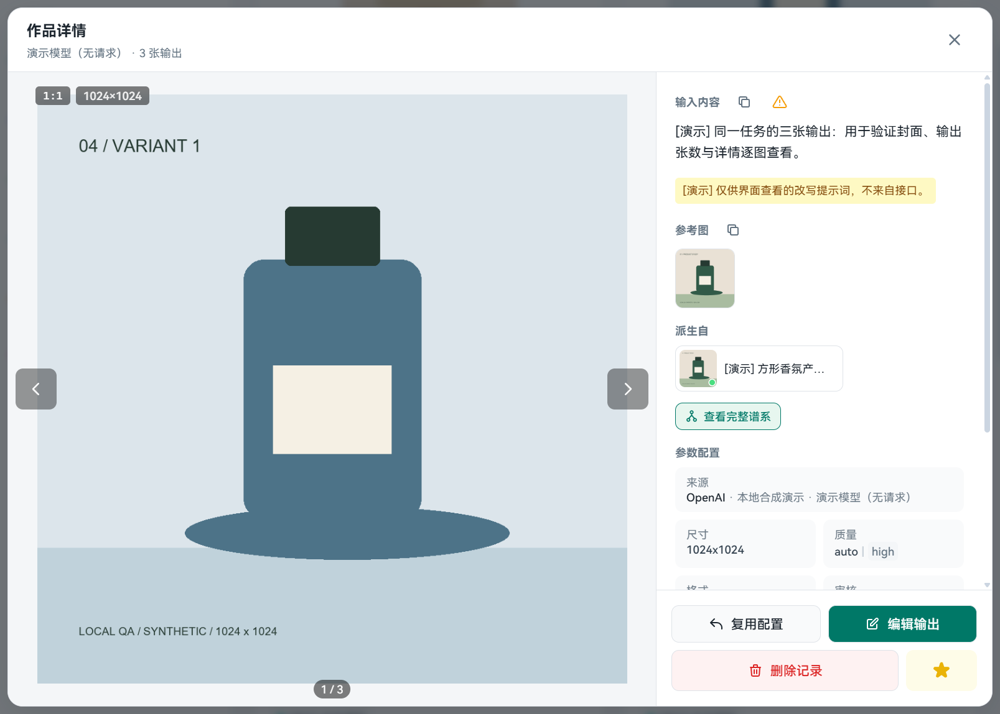
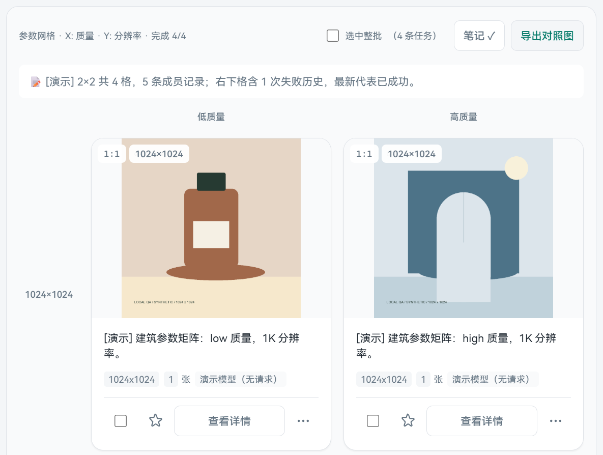

# Image Playground

<p align="center"><strong>从一个想法开始，在同一个工作台里生成、编辑、比较和整理图片。</strong></p>

<p align="center">
  <a href="https://image-playground.diaohan111.workers.dev/">在线体验</a> ·
  <a href="#quick-start">快速开始</a> ·
  <a href="#workflow">创作流程</a> ·
  <a href="docs/deployment.md">部署指南</a>
</p>

Image Playground 是一个本地优先的图像创作前端，支持 **OpenAI 兼容接口与 Google Gemini**。你可以连接自己的 API，用对话整理创作项目，以参考图和遮罩继续编辑，再通过参数矩阵与图片对比挑选结果。



*当前界面实拍。文档中的图片和任务均为带「演示」标记的本地合成样例，用于展示交互，不代表模型生成效果；线上部署可能与仓库当前版本不同。*

## 你可以用它做什么

| 创作环节 | 功能 |
| --- | --- |
| 从想法到图片 | 文字生图、多图生成、风格预设、提示词优化、常用提示词片段 |
| 在结果上继续编辑 | 最多 16 张参考图、粘贴与拖放上传、可视化遮罩、输出转参考图、派生关系追踪 |
| 比较不同方案 | `{选项一\|选项二}` 通配批量、X/Y 参数网格、2–4 条任务对照、带轴标签的对照图导出 |
| 整理作品 | 独立对话、全部作品、收藏分类、提示词与参数搜索、批量操作 |
| 切换创作环境 | 多套 API 配置、模型选择、浅色 / 深色 / 跟随系统、桌面侧栏与手机抽屉 |
| 保存和迁移 | 浏览器本地历史、图片去重、存储管理、ZIP 导出与合并 / 替换导入 |

<a id="quick-start"></a>

## 快速开始

### 1. 打开工作台

直接访问 [在线体验](https://image-playground.diaohan111.workers.dev/)，或在本地启动。开发环境需要 **Node.js 22+** 和 npm：

```bash
git clone https://github.com/han-cczu/image-playground.git
cd image-playground
npm ci
npm run dev
```

打开终端输出的本地地址。已有项目时，在项目根目录执行最后两条命令即可。

### 2. 连接自己的图像 API

点击左下角 **设置 → 图像 API**，填写服务商、API URL、API Key 和模型 ID，然后保存。可以保存多套配置，在底部模型菜单中切换。



*图像生成、提示词优化和反推提示词分别配置；仅使用生图时，先填好「图像 API」即可。图中密钥输入框为空。*

| 接入方式 | API URL 示例 | 选择模型时注意 |
| --- | --- | --- |
| OpenAI 兼容 · Images | `https://api.openai.com/v1` | 使用上游支持的图像模型；生成与编辑分别调用 `images/generations`、`images/edits` |
| OpenAI 兼容 · Responses | `https://api.openai.com/v1` | 使用上游支持 `image_generation` 工具的模型，调用 `responses` |
| Google Gemini | `https://generativelanguage.googleapis.com/v1beta` | 使用支持图像输出的模型，调用 `models/{model}:generateContent` |

接入自定义网关时，将 URL 换成该网关的接口基础地址，保留它要求的路径前缀。**模型和参数能力取决于实际服务商**；项目默认模型不保证在每个网关上可用。Gemini 图像接口不使用遮罩与 `quality` 参数。

### 3. 开始第一轮创作

点击 **新建创作**，写下画面描述，选择模型、尺寸和风格，再点击生成。也可以先点空白页中的示例卡片，将示例提示词填入输入框。

```text
一只深绿色玻璃香氛瓶，放在米白色石质台面上。
左侧自然光，柔和阴影，背景干净，完整呈现瓶身，产品摄影。
```

**每次点击新建都会创建独立对话，可以连续创建多个。** 输入区共用一份提示词、参考图和参数草稿，切换对话时会保留。输入框上方的 **「生成到：…」** 表示新任务归属；浏览「全部作品」时也按这个目标生成。

<a id="workflow"></a>

## 从生成到迭代



### 查看细节，保留创作上下文

卡片完整展示不同画幅的预览，并保留收藏、选择和详情入口。打开 **查看详情**，可以逐张浏览同一任务的输出，查看提示词、参考图、来源配置和参数。



*「复用配置」将任务配置带回输入区；「编辑输出」把生成结果作为下一轮参考图。详情还可以沿派生来源查看完整谱系。*

当接口返回实际参数或改写后的提示词时，详情会显示这些信息，便于与请求内容对照；接口未返回的字段使用请求值。

### 参考图与局部编辑

通过 **参考图** 按钮选图，也可以粘贴图片或将文件拖入页面，单次最多 16 张。参考图支持排序；需要局部修改时，从参考图进入遮罩编辑器，绘制并保存后再提交。

常用的模型、尺寸、风格直接放在输入区底部；**更多** 中提供高级参数、提示词片段、提示词优化、反推提示词和参数网格等工具。提示词优化可对比修改前后再决定采用，反推提示词可从图片提取描述；两者使用各自配置的文本或视觉 API。

### 用批量实验比较方案

普通生成支持提示词通配。例如：

```text
一只{绿色|琥珀色}玻璃瓶，{米白|浅灰}背景，自然柔光，产品摄影
```

这会展开为 **4 条任务**；每条任务仍按所选数量生成图片。超过 20 个组合会要求确认，超过 200 个组合会阻止提交。

需要有组织地比较参数时，打开 **更多 → 参数网格**，选择 X 轴和可选的 Y 轴。可用维度随当前接口能力变化，包括风格、质量、尺寸、格式、数量和提示词通配。



*矩阵视图局部，展示 2×2 实验的第一行。每格显示最新任务，支持批次笔记、补跑和导出带轴标签的 PNG 对照图。*

勾选 **2–4 条已完成且有输出的任务**，还可以进入图片对照。矩阵的「选中整批」会包含同格历史记录；普通全选按当前显示的任务卡片选择。使用网格时，只有选择「提示词通配」轴才会展开 `{a|b}`。

## 整理作品与快捷操作

从左侧进入 **全部作品** 查看跨对话记录，或进入 **我的收藏** 按分类整理。搜索支持提示词和参数，也可以按任务状态筛选。在满足排序条件的单个对话视图中，可以拖动卡片调整顺序；图库、搜索、筛选或矩阵等视图下会禁用拖拽。

| 操作 | 方式 |
| --- | --- |
| 提交当前提示词 | 在提示词框中按 `Ctrl / ⌘ + Enter` |
| 打开命令面板 | `Ctrl / ⌘ + K`，搜索对话、设置、配置、主题或导出命令 |
| 选择多条任务 | 卡片复选框；桌面支持框选与 `Ctrl / ⌘` 点选，手机支持侧滑选择 |
| 关闭当前弹层 | `Esc` |
| 切换放大浏览的图片 | 左右方向键 |

## 数据保存在什么地方

历史记录与图片保存在当前站点的 **IndexedDB** 中，API 配置和草稿等保存在 **localStorage** 中。图片按内容哈希去重，同一张图片被多个任务引用时无需重复存储。

这里的「本地优先」指数据保存方式：**生成时，提示词、参考图、适用的遮罩及认证信息会发送到你配置的 API；使用代理时还会经过该代理。** 提示词优化和反推也会调用对应接口。API Key 以明文保存在本机浏览器中。

在 **设置 → 数据管理** 中查看存储使用情况并导出 ZIP。备份包含历史、图片、对话、收藏分类、片段、批次笔记、去密钥配置及文字 / 参数 / 参考图草稿；**不包含 API Key，也不包含尚未提交的遮罩草稿**。支持合并或替换导入，新设备需要重新填写密钥。

浏览器数据可能因清理站点数据、存储回收或更换设备而丢失，请定期备份。不同浏览器、域名和端口使用各自的存储，不会自动同步。

生产版本成功缓存后，可离线打开界面、查看本地历史；**生成、拉取模型、提示词优化和反推仍需联网**。PWA 安装等功能还取决于浏览器支持及 HTTPS / localhost 等安全上下文。

## 自部署

项目输出静态前端，可部署到静态文件服务器，也提供 Docker 与 Cloudflare Workers 配置。

| 场景 | 入口 |
| --- | --- |
| 本机试跑 Docker | 见下方单容器命令 |
| 自有域名与 HTTPS | [Docker Compose + Caddy](docs/deployment.md#compose-https) |
| 局域网或临时 HTTP 访问 | [LAN 部署](docs/deployment.md#compose-lan) |
| 静态托管 / Cloudflare Workers | [静态与 Cloudflare 部署](docs/deployment.md#static-hosting) |
| API 跨域问题 | [开发代理及生产代理说明](docs/deployment.md#cors) |

在仓库根目录执行：

```bash
docker build -t image-playground .
docker run -d --name image-playground -p 8080:80 image-playground
```

然后打开 `http://localhost:8080`，在页面内配置 API。单容器模式只托管前端；需要跨域代理、HTTPS 或维护升级步骤时，请看 [完整部署指南](docs/deployment.md)。

<details>
<summary>外部集成：通过 URL 预填 API 配置</summary>

`apiUrl`、`apiKey`、`provider` 仅从 URL 的 **hash** 读取，读取后从地址栏清除。查询串中的这三个同名参数会被清理，不会写入配置。

| 参数 | 位置与示例 | 作用 |
| --- | --- | --- |
| `apiUrl` | `#apiUrl=https%3A%2F%2Fexample.com%2Fv1` | 设置当前配置的 API 基础地址 |
| `apiKey` | `#apiKey=YOUR_API_KEY` | 一次性写入当前配置的密钥 |
| `provider` | `#provider=openai` 或 `#provider=gemini` | 切换服务商；跨服务商切换会重置端点、模型并清空旧密钥 |
| `apiMode` | `?apiMode=images` 或 `?apiMode=responses` | 选择 OpenAI 接口模式 |
| `codexCli` | `?codexCli=true` | 开启面向兼容网关的 Codex CLI 模式 |

组合示例（各参数值应进行 URL 编码）：

```text
https://image-playground.diaohan111.workers.dev/?apiMode=images#apiUrl=https%3A%2F%2Fexample.com%2Fv1&apiKey=YOUR_API_KEY
```

示例使用占位符。含真实密钥的链接不要公开分享或提交到仓库。Codex CLI 兼容模式会调整部分参数和多图请求方式，应按所接网关的需要开启。

</details>

## 开发与项目结构

技术栈：**React 19 · TypeScript · Vite 6 · Tailwind CSS 3 · Zustand 5 · dnd-kit · IndexedDB**。

| 命令 | 作用 |
| --- | --- |
| `npm run dev` | 启动 Vite 开发服务 |
| `npm test` | 运行 Vitest 测试 |
| `npm run lint` | 执行 ESLint 检查 |
| `npm run build` | TypeScript 检查、静态构建、Service Worker 资源注入及 CSP 校验，输出至 `dist/` |
| `npm run preview` | 先构建，再通过 Wrangler 本地预览 |
| `npm run deploy` | 依次执行 lint、测试、构建并部署到 Cloudflare；需要自己的账号与配置 |

```text
src/
├── components/       工作台、创作面板、卡片和各类编辑弹窗
├── lib/              API 适配、任务运行、图片处理、导入导出等逻辑
├── store/            状态切片与持久化
└── styles/           浅色 / 深色主题的语义颜色变量
public/               PWA 图标、Service Worker 与静态资源
scripts/              构建辅助与安全策略校验
docs/                 部署、安全策略及设计说明
```

开发代理配置和默认 API 地址环境变量见 [部署指南](docs/deployment.md#local-development)。修改安全响应头或内联主题脚本前，请阅读 [安全响应头说明](docs/security-headers.md)。
