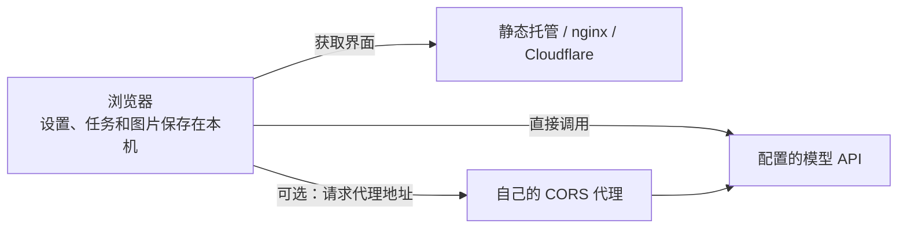
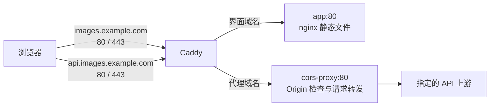

# 部署指南

Image Playground 是在浏览器中运行的应用。静态服务器负责提供界面；图像生成、提示词优化和图像反推请求由浏览器发送到设置中的 API 地址。Docker 部署可以额外提供 CORS 代理，但没有替你保存任务和图片的应用数据库。

以下示例中的域名、IP 和 API 地址需要替换成自己的值。选择一种部署方式完成后，再按需配置代理、备份和更新流程。

## 选择部署方式

| 方式 | 适用场景 | 入口 | API 请求如何发送 |
| --- | --- | --- | --- |
| 本地开发 | 修改代码、调试接口 | Vite 输出的地址，通常为 `http://localhost:5173` | 浏览器直连；OpenAI 兼容图像接口可选 Vite 开发代理 |
| 静态托管 | 已有网站服务器或静态托管平台 | 自己配置的站点地址 | 浏览器直连；需另配代理时自行提供 |
| Docker 单容器 | 快速运行界面、接入已有反向代理 | `http://localhost:8080` | 浏览器直连，不自带对外 API 代理 |
| Compose HTTPS | 有可访问的服务器和域名 | `https://images.example.com` | 浏览器直连，或使用独立的代理子域名 |
| Compose LAN | 局域网临时使用 | `http://服务器IP` | 默认浏览器直连；本文另给可选代理配置 |
| Cloudflare Workers | 使用 Cloudflare 托管静态界面 | 部署命令返回的 URL 或自定义域名 | 浏览器直连；仓库未实现 API 转发 Worker |



浏览器直连时，上游需要允许站点的跨域请求。使用自己的代理时，请求及其中的密钥、提示词和图片会经过该代理，再到达上游。

## 1. 获取代码与准备环境

本地开发、直接构建和 Cloudflare 部署需要 **Node.js 22 或更高版本**、npm 和 Git。Docker 路径需要 Docker；Compose 路径还需要支持 `docker compose` 的 Compose 插件。

```sh
git clone https://github.com/han-cczu/image-playground.git
cd image-playground
npm ci
```

只用 Docker 构建时，不必先在宿主机安装 Node.js 或执行 `npm ci`，Dockerfile 会在构建阶段完成这些步骤。

<a id="local-development"></a>

## 2. 本地开发与开发代理

### 启动界面

```sh
npm run dev
```

打开终端显示的地址。当前 Vite 配置启用了 `host: true`，开发服务器也会监听网络接口；从其他设备访问还取决于主机防火墙和网络。界面的生成、优化、反推配置彼此独立，首次使用时在对应设置页填写地址、密钥和模型。

可以在仓库根目录新建 `.env.local`，设置首次使用时的默认图像 API 地址：

```dotenv
VITE_DEFAULT_API_URL=https://api.openai.com/v1
```

这是构建/开发环境中的默认值，不能替代已经保存在浏览器中的用户设置。`VITE_*` 值会进入前端产物，不要在其中写入私人 API Key。

### 开启 Vite 开发代理

上游不支持浏览器 CORS 时，可以把 [dev-proxy.config.example.json](../dev-proxy.config.example.json) 复制为根目录的 `dev-proxy.config.json`，例如：

```json
{
  "enabled": true,
  "prefix": "/api-proxy",
  "target": "https://api.openai.com/v1",
  "changeOrigin": true,
  "secure": true
}
```

1. 把 `target` 改成开发机器能够访问的真实 API 基址。
2. 重启 `npm run dev`。
3. 在图像 API 设置中使用匹配的 API 基址，例如 `https://api.openai.com/v1`，选择 OpenAI 兼容接口，并打开 **API 代理**。

以上述配置为例，浏览器请求 `/api-proxy/images/generations`，Vite 去掉 `/api-proxy` 前缀后，转发到 `https://api.openai.com/v1/images/generations`。保持 `target` 与设置中的版本路径一致，避免重复或缺少 `/v1`。网关若带有额外路径前缀，应在 `target` 中完整保留。

`secure: true` 校验 HTTPS 上游证书。示例文件原先的 `secure: false` 适合需要关闭此校验的特定开发环境，普通 HTTPS 上游应使用 `true`。

这个开关只接入了 OpenAI 兼容图像请求及其模型列表。**Gemini、提示词优化和图像反推不会因为打开图像 API 的代理开关就一起走 Vite 代理**；需要分别配置可用地址。

开发代理只在开发服务器中存在。`npm run build` 不会把代理服务器打包进 `dist/`。`VITE_API_PROXY_AVAILABLE=true` 只是开放前端代理选项的构建标志，也不会创建 `/api-proxy` 服务；只有自行实现了对应生产路由时才应设置。

<a id="static-hosting"></a>

## 3. 构建与静态部署

```sh
npm run build
```

该命令依次执行 TypeScript 检查、Vite 构建、Service Worker 版本与预缓存清单注入、CSP 内联脚本哈希检查。将完整 `dist/` 内容发布到静态服务器的网站根目录，不要只复制 `index.html` 或 `assets/`。

自建服务器可参考 [nginx.conf](../nginx.conf) 和 [nginx-security-headers.inc](../nginx-security-headers.inc)；Cloudflare 的响应头配置位于 [public/_headers](../public/_headers)。其他平台通常不会自动识别 `_headers`，需要在平台中配置等效响应头。

| 路径 | 当前 nginx 缓存策略 | 部署时需要保持的行为 |
| --- | --- | --- |
| `/sw.js` | `no-cache, no-store, must-revalidate` | 始终能够检查到新的 Service Worker |
| `/index.html` | `no-cache, must-revalidate` | 入口及时更新，避免一直引用旧资源 |
| `/assets/*` | 一年，`immutable` | 文件名包含内容哈希；不存在的文件返回 404 |
| `/manifest.webmanifest` | 一小时 | 使用正确 MIME 类型，保留原路径 |
| `/pwa-icon.svg` | 一天 | 与 manifest 中的引用保持一致 |

尤其不要让不存在的 `/assets/*.js` 回退为返回 200 的 `index.html`。这会产生 JavaScript MIME 错误，还可能把 HTML 当作长期缓存的脚本。当前 Cloudflare 配置使用 `assets.not_found_handling: "none"`，nginx 也对 `/assets/` 单独返回 404。

建议先部署在域名根路径。虽然 Vite 使用相对 `base: './'`，这不代表任意子目录托管都已配置完成；部署到 `/image-playground/` 等子目录时，还需适配 Service Worker 范围、资源路径和服务器响应头规则，并自行验证。不要通过双击 `dist/index.html` 的 `file://` 地址代替 HTTP 服务。

仓库中的 `npm run preview` 实际执行 **构建 + `wrangler dev`**，用于 Cloudflare 本地预览，不是 `vite preview`。

## 4. Docker 单容器

[Dockerfile](../Dockerfile) 使用 Node.js 22 构建，再由 nginx 托管静态产物。以下命令在 PowerShell 和常见 POSIX shell 中均可直接执行：

```sh
docker build -t image-playground:local .
docker run -d --name image-playground --restart unless-stopped -p 8080:80 image-playground:local
```

打开 `http://localhost:8080`。端口映射 `8080:80` 允许通过宿主机网络接口访问；仅供本机使用时，可以改成 `127.0.0.1:8080:80`。

检查状态与日志：

```sh
docker ps --filter name=image-playground
docker logs --tail=100 image-playground
docker exec image-playground wget -qO- http://127.0.0.1/healthz
```

`/healthz` 正常时返回 `ok`，只表示静态服务器可响应，不代表模型 API 可用。Dockerfile 本身没有声明 `HEALTHCHECK`；Compose 中的 `app` 服务另外配置了健康检查。

单容器不包含 Caddy 或 CORS 代理，也没有实现 `/api-proxy` 路由。若需要 HTTPS，可以放到自己已有的反向代理后面，或使用下一节的 Compose 方案。

### 可选：在构建版本中带上 Git 提交号

`.dockerignore` 排除了 `.git`，需要显式传入提交号，才能让 Service Worker 缓存版本对应到 Git 提交；不传仍会使用 `nogit` 和构建时间生成缓存版本。

PowerShell：

```powershell
$buildCommit = (git rev-parse --short HEAD).Trim()
docker build --build-arg "GIT_COMMIT=$buildCommit" -t image-playground:local .
```

Bash：

```bash
docker build --build-arg GIT_COMMIT="$(git rev-parse --short HEAD)" -t image-playground:local .
```

宿主机的 `.env.local` 和 `dev-proxy.config.json` 也被排除在 Docker 构建上下文外。当前 Dockerfile 只定义了 `GIT_COMMIT` 构建参数；给已构建的容器添加 `-e VITE_DEFAULT_API_URL=...` 不会改写前端 JavaScript。常规部署直接在界面中设置 API；需要定制编译默认值时，应显式调整构建流程后重新构建。

<a id="compose-https"></a>

## 5. Compose HTTPS：域名、界面和 CORS 代理

[docker-compose.yml](../docker-compose.yml) 中的服务关系如下：



`app` 和 `cors-proxy` 默认不发布宿主机端口；`https` profile 启动 Caddy，对外发布 TCP 80 和 443。只执行不带 profile 的 `docker compose up -d` 会启动内部服务，但没有供浏览器访问的入口。

### 第一步：准备两个域名

本文使用以下示例，部署时全部替换成自己的值：

| 用途 | 示例 |
| --- | --- |
| 界面 | `images.example.com` |
| API 代理 | `api.images.example.com` |

将两个域名的 DNS 记录指向服务器，确保相关 A/AAAA 记录可达，服务器防火墙、路由器端口转发和已有服务允许 Caddy 使用 80、443 端口。保留 Caddy 的持久化数据卷，以保存证书和账户信息。

Caddy 会为符合条件的域名申请和续期公开可信证书。签发依赖 DNS、端口、外部网络和证书机构验证，并不由启动容器本身保证成功。详见 [Caddy 自动 HTTPS 文档](https://caddyserver.com/docs/automatic-https)。

### 第二步：修改 Caddy 域名

编辑 [Caddyfile](../Caddyfile)：

- 把界面站点的 `your-domain.com` 改为 `images.example.com`。
- 把代理站点的 `cors.your-domain.com` 改为 `api.images.example.com`。
- 保留原有的响应头和反向代理配置。

两个站点最终分别指向 `app:80` 和 `cors-proxy:80`。如果完全不需要 CORS 代理，可以删除代理站点块，并只准备界面域名。

<a id="cors"></a>

### 第三步：修改代理来源白名单和上游

这一步在使用代理时必做。只修改域名或 `$upstream`、不修改 Origin 白名单，会得到 403。

在 [cors-proxy.conf](../cors-proxy.conf) 中，将 `map $http_origin $cors_allow_origin` 块替换为：

```nginx
map $http_origin $cors_allow_origin {
    default "";
    "https://images.example.com" $http_origin;
}
```

这里填的是**浏览器打开的界面来源**，不是代理地址。Origin 由协议、主机和非默认端口组成，不带路径或尾部 `/`。如果允许多个界面来源，为每个来源增加一行精确匹配。

然后选择一个上游，同时修改这两个值：

```nginx
set $upstream      "https://api.openai.com";
set $upstream_host "api.openai.com";
```

Gemini 对应：

```nginx
set $upstream      "https://generativelanguage.googleapis.com";
set $upstream_host "generativelanguage.googleapis.com";
```

`$upstream` 填上游 origin，即协议和主机，不要添加 `/v1`、`/v1beta` 或完整端点。当前配置会原样转发浏览器的请求路径，例如 `/v1/images/generations`。

同一个代理服务只指向一个上游 origin。若图像、优化和反推使用不同供应商，需要分别直连，或为不同上游增加独立的代理服务、配置文件和域名。

来源白名单约束浏览器跨域调用，**不等同于用户认证**；非浏览器客户端可以自行设置 Origin。代理不会替用户添加统一的 API Key，而是转发请求中提供的凭据。公开服务若需要访问控制，应在入口另行配置认证。

### 第四步：启动服务

```sh
docker compose --profile https config
docker compose --profile https up -d --build
docker compose --profile https ps
docker compose --profile https logs --tail=100 caddy
```

可选：启动前用 PowerShell 的 `$env:GIT_COMMIT = (git rev-parse --short HEAD).Trim()`，或 Bash 的 `export GIT_COMMIT="$(git rev-parse --short HEAD)"`，为 Compose 构建提供提交号。

浏览器打开 `https://images.example.com`。在需要使用代理的 API 配置中填入：

| 接口类型 | API 基址示例 |
| --- | --- |
| OpenAI 兼容图像 / 文本 | `https://api.images.example.com/v1` |
| Gemini | `https://api.images.example.com/v1beta` |

选择与上游匹配的接口类型、模型和密钥。这里使用的是可直接访问的代理基址，图像设置中的 **API 代理** 开关保持关闭；该开关指向 `/api-proxy`，与这里的代理子域名是不同入口。优化、反推如需使用代理，分别修改各自的 API 地址。

<a id="compose-lan"></a>

## 6. Compose LAN：HTTP + IP

不需要域名或证书时：

```sh
docker compose --profile lan up -d --build
docker compose --profile lan ps
```

通过 `http://服务器IP` 访问。当前 [Caddyfile.lan](../Caddyfile.lan) 只将请求转发给 `app`。虽然 `cors-proxy` 服务也会启动，**默认 LAN 配置没有给它提供浏览器可访问的路由**；只修改其上游不会使代理自动可用。

`https` 和 `lan` profile 都占用宿主机的 80 端口，不要同时启用。切换前停止原模式，例如：

```sh
docker compose --profile https down
docker compose --profile lan up -d --build
```

普通 `down` 会保留命名卷，不要为切换模式额外添加 `-v`。

### 可选：为局域网公开独立的代理端口

如果上游不能直连，可以为代理增加端口。以下以服务器 IP `192.168.1.50` 为例：

1. 按 HTTPS 章节配置 `cors-proxy.conf` 的上游。
2. 将来源白名单改为实际界面地址：

```nginx
map $http_origin $cors_allow_origin {
    default "";
    "http://192.168.1.50" $http_origin;
}
```

3. 在仓库根目录新建 `compose.lan-proxy.yml`：

```yaml
services:
  cors-proxy:
    ports:
      - "8081:80"
```

4. 使用两个配置文件启动，并让局域网客户端能够访问宿主机 8081 端口：

```sh
docker compose -f docker-compose.yml -f compose.lan-proxy.yml --profile lan up -d --build
```

5. 在界面中填入 `http://192.168.1.50:8081/v1`，或对应 Gemini 上游的 `/v1beta`，保持 **API 代理** 开关关闭。

白名单仍填界面地址 `http://192.168.1.50`，不要误填代理端口 `8081`。此方案仅适合预期的局域网访问范围；HTTP 不提供传输加密。后续更新、重启和停止时，继续使用相同的两个 `-f` 参数。

### HTTP 与浏览器能力

通过普通局域网 IP 的 HTTP 地址访问时，页面通常不属于安全上下文，本项目不会注册生产 Service Worker；PWA 和图片剪贴板等能力也受浏览器限制。`http://localhost` 和回环地址是浏览器允许的例外，不能与普通 HTTP IP 地址一概而论。详见 [MDN 安全上下文说明](https://developer.mozilla.org/en-US/docs/Web/Security/Defenses/Secure_Contexts)。

使用 HTTPS 可以满足这些功能的基础条件，是否能够安装 PWA、写入剪贴板还取决于浏览器支持、权限和交互条件。

## 7. 可选：通过 sslip.io 使用映射域名

没有自有域名、但有公网可达 IP 时，可以尝试提供 IP 映射的公共 DNS 服务。将 IP 写入域名后，DNS 将其解析到相应地址；它不提供隧道，也不会开放防火墙或让内网服务器变得公网可达。相关说明见 [nip.io / sslip.io](https://nip.io/)。

假设公网 IP 为 `203.0.113.10`，可以使用以下域名结构。**此 IP 是文档示例，必须替换成真实服务器 IP**：

| 用途 | 域名示例 |
| --- | --- |
| 界面 | `203.0.113.10.sslip.io` |
| 代理 | `cors.203.0.113.10.sslip.io` |

沿用 HTTPS 章节的所有步骤：修改 Caddyfile 两个域名，将代理来源白名单设置为 `https://203.0.113.10.sslip.io`，选择上游，然后启动 `--profile https`。

证书仍需要完成公开证书机构的验证。公网连通性、DNS 服务可用性、证书限流都会影响结果；把私有 IP 写进域名并不能自动获得可用的公网验证链路。适合临时验证，长期站点宜使用自己能够管理的域名。

## 8. Cloudflare Workers

仓库通过 [Vite 的 Cloudflare 插件](https://developers.cloudflare.com/workers/vite-plugin/) 构建静态资产，并由 Wrangler 发布。配置入口是 [wrangler.jsonc](../wrangler.jsonc)；构建时插件会生成实际部署所需的配置。

安装依赖后登录并确认账户：

```sh
npx wrangler login
npx wrangler whoami
```

检查 `wrangler.jsonc` 中的 `name`。默认是 `image-playground`，发布会在当前账户创建或更新这个名称的 Worker；需要独立站点时先改成自己的名称。

本地预览：

```sh
npm run preview
```

该命令会先构建，再运行 `wrangler dev`。以终端打印的地址为准，常见端口为 8787。

准备发布时执行：

```sh
npm run deploy
```

脚本会运行 lint、测试、构建，随后执行 `wrangler deploy`。这条命令会实际发布到 Cloudflare；完成后使用终端返回的 URL，也可在 Cloudflare 中为该 Worker 绑定自定义域名。

当前仓库配置托管前端静态资产，没有实现把图像 API 请求转发到上游的 Worker 代码。部署到 Cloudflare 不会自动解决上游 CORS，也不会让 API 请求自动从 Cloudflare 发出；仍需使用允许浏览器调用的 API 地址或另行部署代理。

## 9. 更新、备份与缓存维护

### 先区分浏览器数据与服务器文件

任务、图片和设置位于浏览器的本地存储中。更换浏览器、设备，或改变协议、主机、端口，都会进入不同的存储来源。例如 `http://192.168.1.50` 与 `https://images.example.com` 不共享数据。

迁移域名或清理浏览器数据前，先在原站点的 **设置 → 数据管理** 中导出备份，再到新站点导入。Docker 的 Caddy 数据卷保存证书等服务数据，不是用户图片备份；重建容器也不会把一个浏览器中的任务同步给另一个浏览器。

### 更新应用

先更新自己的代码副本并处理本地配置差异，再重新构建发布。Compose HTTPS 示例：

```sh
docker compose --profile https up -d --build
docker compose --profile https ps
```

LAN 使用 `--profile lan`；如果启用了前述额外代理端口，保留两个 `-f` 参数。此方式可能重建或重启容器，不是无中断滚动发布。

修改挂载的代理/Caddy 配置后，检查语法并重启相应服务：

```sh
docker compose exec cors-proxy nginx -t
docker compose restart cors-proxy
docker compose --profile https exec caddy caddy validate --config /etc/caddy/Caddyfile --adapter caddyfile
docker compose --profile https restart caddy
```

单容器更新时先构建新镜像，再停止并替换旧容器：

```sh
docker build -t image-playground:local .
docker stop image-playground
docker rm image-playground
docker run -d --name image-playground --restart unless-stopped -p 8080:80 image-playground:local
```

需要回退时，重新运行之前保留的镜像标签或发布先前的完整静态产物。部署者应提前保留这些版本。

### Service Worker 与离线使用

生产构建会生成独立的缓存版本和预缓存清单；注册 Service Worker 还要求浏览器处于安全上下文。开发模式不会使用生产离线缓存。

完成首次在线加载并缓存后，可离线打开应用界面和使用已保存在本机的数据。生成、优化、反推及其他远端 API 请求仍需要网络；远程图片和额外网络资源也不保证离线可用。

发布时完整上传同一批构建产物，避免新 `sw.js` 引用尚未上传的资源。出现更新提示时，先等待运行中的任务完成，再刷新页面。若用户一直停留在旧版，按以下顺序排查：

1. 检查线上 `/sw.js` 和 `/index.html` 的实际响应及缓存头，确认 CDN 没覆盖上述规则。
2. 检查预缓存资源是否存在，尤其是 `/assets/` 的 404 和错误的 HTML 回退。
3. 在浏览器开发者工具的 Application / 应用面板中检查 Service Worker 更新状态；必要时更新或注销该 Worker，再刷新。
4. 若确实需要清除整个站点数据，先导出备份；清除站点数据会同时影响本地任务、图片和设置。

[public/sw.js](../public/sw.js) 中保留了 `KILL_SWITCH` 恢复入口。紧急情况下可由维护者启用后重新构建发布，使收到新脚本的客户端注销 Worker 并刷新；恢复正常后需再次关闭并发布。它依赖客户端实际下载到更新，不能保证离线用户或被错误 CDN 缓存阻挡的用户立即恢复。

如果修改 `index.html` 的内联主题脚本，需要同步相关 CSP 哈希。`npm run build` 会检查这一契约，详见 [安全响应头说明](security-headers.md)。当前 CSP 使用 `Content-Security-Policy-Report-Only`，不能把报告模式当作已启用的强制拦截。

## 10. 常见问题与排查

| 现象 | 优先检查 |
| --- | --- |
| Compose 已启动，但打不开页面 | 是否带了 `--profile https` 或 `--profile lan`；是否端口冲突；主机防火墙是否允许访问 |
| HTTPS 证书申请失败 | DNS A/AAAA、80/443 可达性、端口转发、Caddy 日志、证书机构限制；不要仅凭容器运行判断签发成功 |
| LAN 能打开界面，代理不能用 | 默认 LAN 没有代理入口；是否按可选方案发布 8081，或使用了其他真实存在的代理 |
| 代理返回 403 | `Origin` 是否精确命中白名单；协议、端口和域名是否一致；代理是否已重启加载新配置 |
| 浏览器报 CORS / `Failed to fetch` | 在 Network 中检查预检和实际请求；也可能是 DNS、TLS、混合内容或连接失败，并非都由 CORS 头引起 |
| API 返回 HTML 或 JSON 解析失败 | 是否把 API 地址填成界面地址；是否错误打开 `/api-proxy` 开关；代理路径是否落入静态站点回退 |
| 上游 401 / 403 / 404 | 密钥、权限、模型及版本路径；代理是否指向正确上游；不要把上游拒绝误判成界面故障 |
| 上传大图返回 413 | `cors-proxy.conf` 实际限制请求体为 `50m`；base64 会放大体积；同时检查外层代理/平台限制 |
| 并发后出现 503 | 代理按来源 IP 限流为 `60r/m`、突发 `30`；当前 nginx 没自定义限流状态码，也需排查其他 503 来源 |
| 请求超时、流式内容迟迟不出现 | 代理连接超时为 30 秒、读写超时为 600 秒；同时检查上游、Caddy、CDN 的超时与缓冲策略 |
| HTTP IP 下不能安装 PWA 或复制图片 | 检查是否安全上下文；普通局域网 HTTP IP 不等同于 localhost |
| 换域名后历史记录消失 | 浏览器按来源隔离数据；从原来源导出，再到新来源导入 |

### 不携带密钥的代理检查

PowerShell 使用 `curl.exe`，避免部分环境把 `curl` 解析为 PowerShell 别名。下面示例检查允许来源的预检：

```powershell
curl.exe -i -X OPTIONS "https://api.images.example.com/v1/models" -H "Origin: https://images.example.com" -H "Access-Control-Request-Method: GET" -H "Access-Control-Request-Headers: authorization"
```

在 Linux/macOS 中将 `curl.exe` 换为 `curl`。配置和连接正常时，预期返回 204，且 `Access-Control-Allow-Origin` 与界面来源一致。它只验证到代理的预检链路，不验证上游密钥或模型能力。

直接用不含 `Origin` 的 curl 请求代理业务路径会被当前配置拒绝，返回 403 是预期行为。`/healthz` 是例外，健康检查返回 200 同样不能证明上游可调用。

常用日志：

```sh
docker compose logs --tail=100 app cors-proxy
docker compose --profile https logs --tail=100 caddy
docker compose --profile lan logs --tail=100 caddy-lan
```

排错时保留 URL 路径、状态码和时间，分享请求信息前遮盖 API Key、Authorization 和图片内容。

[返回 README](../README.md)
